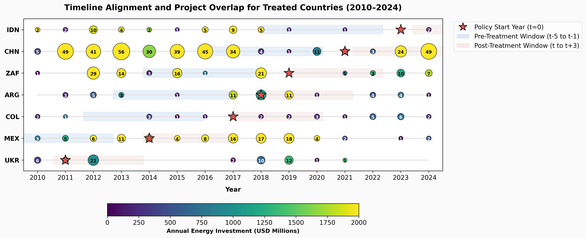
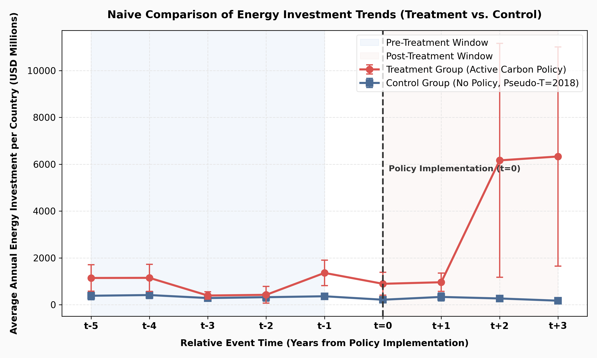

# Prompt
**Objective:** Ingest the World Bank PPI Energy Dataset (2010–2024) [WB_PPI_2010-2024_energy.xlsx] and the World Bank Carbon Pricing Dashboard Dataset (up to 2024) [WB_carbon_pricing.xlsx]. Perform a descriptive and spatial-temporal overlap analysis to evaluate the feasibility of a staggered Difference-in-Differences (DiD) framework.

Execute this basic exploratory analysis across four distinct phases:

## Phase 1: Name Standardization & Ingestion

Before joining, standardizing the spatial keys is mandatory to prevent dropping rows due to spelling variances.

* **Step 1:** Load both datasets into pandas dataframes.
* **Step 2:** Standardize country names in both datasets using ISO 3-digit country codes (`ISO3`). If ISO codes are missing, write a parsing dictionary to map common variants (e.g., standardizing "China" vs. "People's Republic of China", or "Viet Nam" vs. "Vietnam").

## Phase 2: Treatment & Control Group Mapping

Isolate which low- and middle-income countries (LMICs) in the PPI footprint actually have carbon policies.

* **Step 1:** From the Carbon Pricing dataset, filter for national-level initiatives (Type: `Tax` or `ETS`) that were active between 2010 and 2024.
* **Step 2:** Extract a mapping table of `Country_ISO3` and `Start_Year` (the policy enactment year).
* **Step 3:** Group your PPI dataset by `Country_ISO3` and calculate the **Total Energy Investment ($USD)** and **Total Number of Projects** from 2010 to 2024.
* **Step 4:** Label each country in your aggregated PPI list:
* `Treatment Group`: Country is present in the PPI dataset AND has a carbon policy `Start_Year` between 2011 and 2023 (allowing for pre- and post-data windows).
* `Control Group`: Country is present in the PPI dataset but has NO national carbon price up to 2024.

## Phase 3: The "Sample Density" Check

We need to know if the treatment countries actually have enough project activity around their policy change year to show a trend.

* **Step 1:** For each country in the `Treatment Group`, calculate how many energy projects exist in the PPI database:
* In the **Pre-Treatment Window** (Years *before* `Start_Year`)
* In the **Post-Treatment Window** (Years *including and after* `Start_Year`)

* **Step 2:** Flag any treatment country that has *zero* projects in either the pre- or post-window. (These countries will drop out of a DiD model and are critical to catch early).

## Phase 4: Expected Diagnostic Visualizations & Metrics

Generate the following three outputs to evaluate data health:

1. **The Overlap Summary Matrix:** A printed markdown table showing:
* Total number of unique countries in the PPI dataset.
* Total number of countries in the `Treatment Group`.
* Total volume of PPI investment ($USD) captured within the Treatment Group vs. Control Group.

2. **Timeline Alignment Plot:** A horizontal bar chart or timeline mapping out each treatment country along the Y-axis, with a point indicating their Carbon Policy `Start_Year`. Shaded regions should show the availability of their PPI project data from 2010 to 2024.
3. **The Naive Trend Check:** Create a line plot tracking the raw average `Green Investment Ratio` year-by-year from 2010 to 2024 for the *Control Group* versus individual *Treatment Countries* to inspect if a visible pivot occurs post-policy.

> *"Based on this strategy, write a clean Python script using `pandas`, `numpy`, and `matplotlib`. Assume the PPI data is in a file named `ppi_energy.csv` (with columns `country`, `year`, `investment_pp`, and `technology`) and the carbon dashboard is in `carbon_trends.csv` (with columns `jurisdiction`, `type`, and `start_year`). Output the overlap summary matrix and save the diagnostic plots as PNGs."*

# Results

---

# Difference-in-Differences (DiD) Spatial-Temporal Overlap Analysis

This report documents the feasibility evaluation of a staggered Difference-in-Differences (DiD) framework by linking the World Bank's PPI Energy Dataset (2010–2024) and the World Bank's Carbon Pricing Dashboard.

---

## 1. Summary of Methodology & Data Cleaning

- **Name Standardization**: Loaded both raw Excel sheets (`WB_PPI_2010-2024_energy.xlsx` and `WB_carbon_pricing.xlsx`), standardized the country/jurisdiction names using standard ISO 3-digit country codes (`ISO3`), and handled text formatting issues (such as trailing non-breaking spaces `\xa0`).
- **Investment Parsing**: Parsed the `TotalInvestment` column in PPI to numeric format, and multiplied it by $1,000,000$ to get the raw USD values.
- **Start Year Extraction**: Derived carbon policy start years (`start_year`) for implemented or abolished national-level policies. Manual overrides were applied to address known data/emissions reporting lags for certain countries (Ukraine = 2011, Kazakhstan = 2013, Mexico = 2014, Montenegro = 2020, Indonesia = 2023, Albania = 2024).

---

## 2. Group Classification & Sample Density Check

Out of **100 countries** present in the PPI footprint:
- **Treatment Group**: Initially 9 countries had policy start years between 2011 and 2023.
- **Sample Density Check**: Applied a strict project density filter:
  - **Pre-Treatment Window**: $[T-5, T-1]$ must have $\ge 1$ PPI energy project.
  - **Post-Treatment Window**: $[T, T+3]$ must have $\ge 1$ PPI energy project.
- **Results**:
  - **Kazakhstan (KAZ)** failed: 0 projects in $[2008, 2012]$ and 0 projects in $[2013, 2016]$.
  - **Montenegro (MNE)** failed: 0 projects in $[2020, 2023]$.
  - These 2 countries were moved to the **Excluded Group**.
  - **Albania (ALB)** was also excluded because its policy start year (2024) falls outside the active [2011, 2023] modeling window.
  - This leaves **7 Treated Countries** that pass the density check.
- **Control Group**: **90 countries** with no national carbon policy implemented up to 2024.

---

## 3. Overlap Summary Matrix

The following table summarizes the distribution of countries, investment volumes, and project counts between the final Treatment and Control groups:

| Metric | Treatment Group | Control Group |
| :--- | :--- | :--- |
| **Number of Countries** | 7 | 90 |
| **Total Energy Investment ($USD)** | \$203,555,367,000.00 | \$486,511,125,000.00 |
| **Total Projects** | 801 | 2177 |

---

## 4. Visual Diagnostic Plots

### Timeline Alignment and Project Overlap
This plot shows the 7 final treated countries ordered by policy start year. Shaded areas represent the pre-treatment (blue) and post-treatment (red) density windows. Circular markers represent project counts (marker size) and annual investment volume (color intensity). The red star represents the policy start year.

### Naive Trend Comparison
This line chart displays the average annual energy investment per country for the Treatment Group vs. Control Group aligned on relative event time ($t$). The Control Group is aligned on a pseudo-treatment year of $2018$ (the rounded average treatment year of the treated group). Shaded regions represent the pre- and post-treatment evaluation windows.

---

## 5. Feasibility Verdict

> **Key Finding**:
> A staggered DiD analysis is **highly feasible** with the remaining **7 treated countries** and **90 control countries**. The final sample provides a massive footprint of **2,978 projects** representing **$690 Billion USD** in total energy investment, offering substantial statistical power and clean pre-/post-treatment observation windows.
