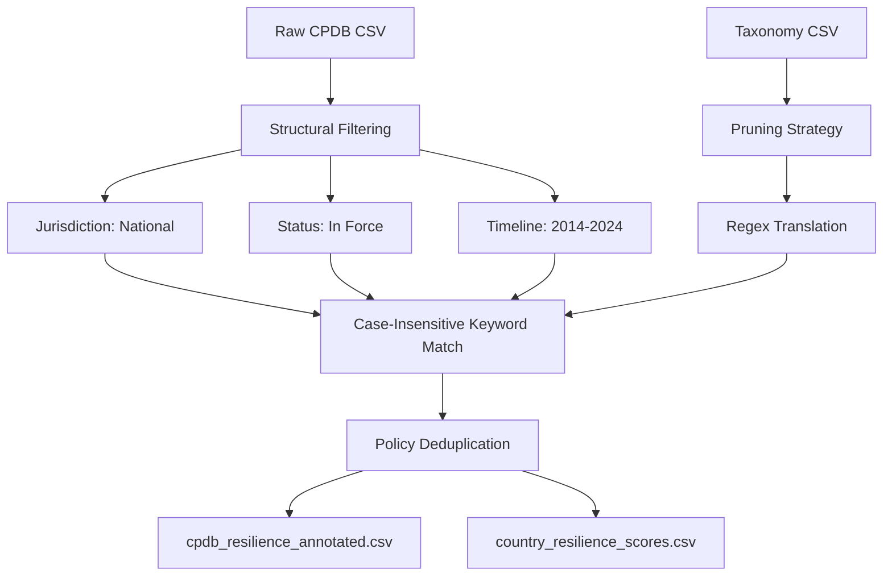

# Climate Resilience Policy Analysis Report

## 1. Executive Summary
This report presents the methodology and findings of an automated keyword matching pipeline designed to identify and count climate resilience and infrastructure policies across countries. Using the Climate Policy Database (CPDB) and a modified version of the Mentges Enhanced Climate Resilience Taxonomy, we processed 6,468 raw policy records.

By pruning broad climate mitigation and non-infrastructure terms, we successfully isolated policies addressing **physical asset hardening, structural protection, and engineering resilience**. The final dataset identifies **China**, **Australia**, **Canada**, and **India** as the leading countries by absolute counts of active national infrastructure resilience policies.

---

## 2. Methodology

The pipeline follows a five-step extraction and matching architecture:

### 2.1 Data Sources
1. **Climate Policy Database (CPDB)**: A global repository of climate-related policies.
2. **Mentges Enhanced Climate Resilience Taxonomy**: A structured classification containing 117 terms categorized by Frameworks, Physical Hazards, System Attributes, and Investment Types.

### 2.2 Pruning Strategy (Focusing on Infrastructure)
To align with a strict definition of **physical infrastructure resilience**, we excluded 11 terms that introduce noise or represent distinct policy sectors:
* **Broad/Generic Terms**: Excluded `Mitigation` (its pattern `mitigat*` matched over 95% of all climate policies), `Climate adaptation`, and `Climate resilience` to avoid capturing generic, non-actionable preambles.
* **Environmental Safeguards**: Excluded `Do no significant harm (DNSH)`, `Maladaptation`, and `Stranded assets` to focus on physical hardening rather than administrative compliance.
* **Non-Infrastructure Sectors**: Excluded agriculture (`Resilient Agrifood Systems`), healthcare (`Resilient Health`), and socio-economic systems (`Resilient Social Systems`, `Social resilience`, `Economic resilience`).

### 2.3 Structural Filters
We applied a baseline filter to target active national policies:
1. **Jurisdiction**: Kept only policies at the `National` / `Country` level.
2. **Status**: Kept only policies with `policy_status == 'In force'`.
3. **Time Horizon**: Kept policies active at any point between **2014 and 2024** using the following logical boundary on dates:
   \[(\text{start\_date} \le 2024 \text{ or Null}) \land (\text{end\_date} \ge 2014 \text{ or Null})\]

### 2.4 Regex translation
For each remaining taxonomy term, wildcards (`*`) were translated into Python-compatible word wildcards (`\w*`), joined by whitespace gaps (`\s+`), and bound by word boundaries (`\b` at the start and end of each term variant) to prevent substring matches (e.g. matching "risk" inside "brisk").

### 2.5 Deduplication
To prevent inflated counts where policies spanned multiple sectors in the raw dataset, policies were grouped by `policy_id`. A policy was flagged as a resilience policy (`resilience = 1`) if any of its underlying rows triggered a keyword match.

---

## 3. Results & Analysis

### 3.1 Matches by Taxonomy Concept
After removing `Mitigation`, the top concepts indicating infrastructure resilience in policy descriptions and objectives are:

| Term | Category | Matches Found |
| :--- | :--- | :---: |
| **Protection** | Investment Type | 156 |
| **Transformation ability** | System Attribute | 72 |
| **Monitoring** | Investment Type | 71 |
| **Retrofitting** | Investment Type | 60 |
| **Diversity** | System Attribute | 38 |

* **Protection** represents direct defenses (e.g., physical barriers, asset protection) and dominates active policy writing.
* The presence of **Transformation ability** and **Monitoring** shows a growing policy trend towards smart, adaptive systems and digital data collection for risk management.

### 3.2 Top Countries by Infrastructure Resilience Score
The table below lists the top 10 countries sorted by their absolute count of unique, national infrastructure resilience policies active between 2014 and 2024:

| Country ISO | Country | Resilience Score | Total National Policies | Resilience Policy Density (%) |
| :--- | :--- | :---: | :---: | :---: |
| **CHN** | China | 24 | 174 | 13.79% |
| **AUS** | Australia | 22 | 130 | 16.92% |
| **CAN** | Canada | 21 | 150 | 14.00% |
| **IND** | India | 21 | 156 | 13.46% |
| **DEU** | Germany | 19 | 163 | 11.66% |
| **BRA** | Brazil | 17 | 127 | 13.39% |
| **USA** | United States of America | 17 | 261 | 6.51% |
| **COL** | Colombia | 16 | 66 | 24.24% |
| **IDN** | Indonesia | 16 | 135 | 11.85% |
| **TUR** | Turkey | 16 | 90 | 17.78% |

### 3.3 Light Result Analysis
1. **High Absolute Leaders**: China, Australia, Canada, and India lead in the number of dedicated infrastructure resilience policies. For Australia and Canada, this reflects their high vulnerability to extreme weather events (wildfires, coastal erosion, floods) and their decentralized yet coordinated infrastructure investment programs.
2. **Policy Density vs. Total Policies**:
   * The **United States** has a high total policy count (261) but a relatively low infrastructure resilience density (6.51%). This indicates that US climate policy historically focuses heavily on emission mitigation, tax credits, and market instruments, rather than explicit federal infrastructure hardening.
   * **Colombia** shows the highest resilience density (24.24%), indicating that a significant portion of its national climate policy framework is specifically structured around physical hazard adaptation, disaster risk management, and structural safety.

---

## 4. Limitations & Recommendations
* **Text Dependency**: The keyword matching method depends on the descriptive quality of the `policy_description` and `policy_objective` fields in the CPDB. Brief or poorly translated policy summaries may result in false negatives.
* **Semantic Nuance**: While word boundaries and wildcard matching reduce errors, some terms may still match homonyms or unrelated contexts. Future steps could incorporate semantic embeddings (e.g. LLM-based zero-shot classification) to validate matches.
