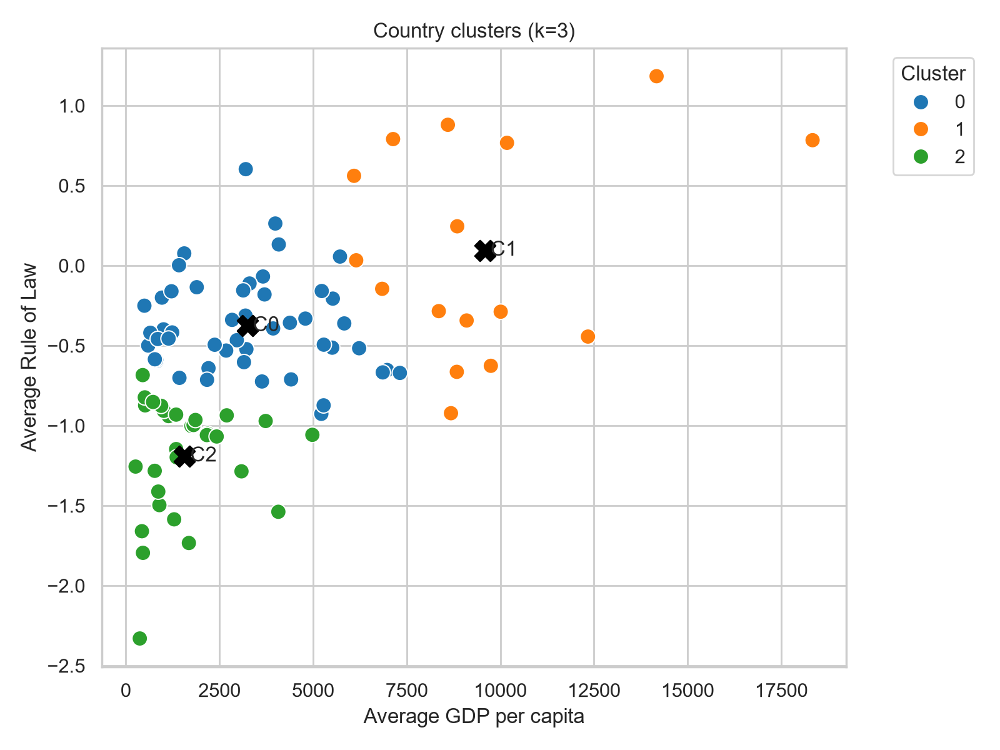
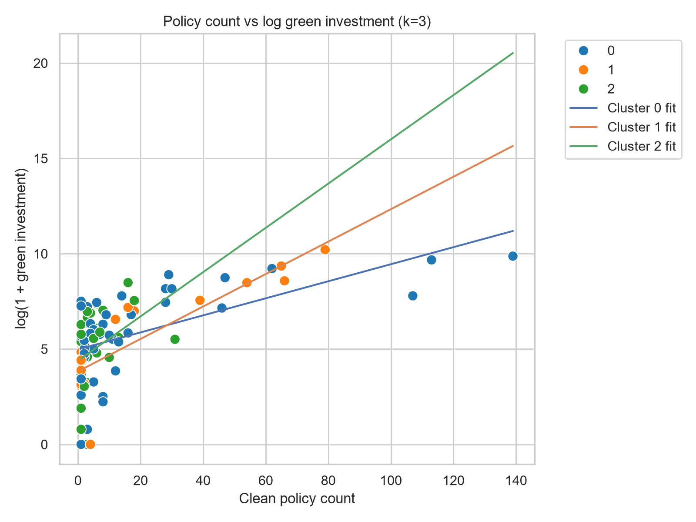

# 3-cluster analysis report

## 1. Objective

This report summarizes a country-level analysis of the relationship between clean policy count and green investment, allowing the slope of that relationship to vary by cluster. The analysis uses 95 country-level observations and clusters countries on the basis of two structural characteristics:

- average GDP per capita over 2000–2024,
- average rule of law over 2000–2024.

The main question is whether the association between policy count and green investment differs across clusters, and whether the slope is especially strong in the relatively high-income and higher-rule-of-law group.

## 2. Data and variables

The analysis uses the file:

- [notebooks/Shota Emoto/results/copilot/country_cluster_regression_data_k3.csv](notebooks/Shota%20Emoto/results/copilot/country_cluster_regression_data_k3.csv)

### Variables used

- `avg_gdp_pc`: average GDP per capita (2000–2024)
- `avg_rule_law`: average rule of law score
- `clean_policy_count`: number of clean policies
- `green_investment_narrow`: narrow green investment measure
- `log_green`: $\log(1 + \text{green\_investment\_narrow})$
- `cluster`: cluster assignment from K-means clustering on `avg_gdp_pc` and `avg_rule_law`

### Descriptive overview

The sample contains 95 country-level observations.

```text
avg_gdp_pc
- mean: 3,050.0
- std: 2,762.0
- min: 163.0
- max: 13,108.0

avg_rule_law
- mean: -0.63
- std: 0.66
- min: -1.76
- max: 1.03

clean_policy_count
- mean: 13.7
- std: 24.6
- min: 0
- max: 164

green_investment_narrow
- mean: 1,560.4
- std: 3,661.2
- min: 0
- max: 24,560

log_green
- mean: about 5.5
- std: about 2.1
```

## 3. Cluster solution

Countries were grouped into three clusters using K-means on the standardized variables:

$$
X_i = \left( \text{avg\_gdp\_pc}_i, \text{avg\_rule\_law}_i \right)
$$

The resulting clusters are summarized below.

| Cluster | N | Avg GDP per capita | Avg Rule of Law | Avg policy count | Avg log green investment |
|---|---:|---:|---:|---:|---:|
| 0 | 49 | 3,242.352 | -0.376 | 17.286 | 5.752 |
| 1 | 16 | 9,588.274 | 0.096 | 22.625 | 5.753 |
| 2 | 30 | 1,570.286 | -1.190 | 5.533 | 5.032 |

Interpretation:

- Cluster 0 is the middle-income / near-average institutional group.
- Cluster 1 is the relatively high-income and higher-rule-of-law group.
- Cluster 2 is the low-income and low-rule-of-law group.

## 4. What is being estimated

The core quantity of interest is the slope of the relationship between clean policy count and green investment within each cluster.

### 4.1 Cluster-specific slope in simple regressions

For each cluster, a simple regression is estimated of the form:

$$
\log(1 + \text{green\_investment\_narrow}_i)
= \alpha_c + \beta_c \cdot \text{clean\_policy\_count}_i + \varepsilon_i
$$

where $\beta_c$ is the slope for cluster $c$.

### 4.2 Cluster-specific slope in the interaction model

A pooled interaction model is also estimated so that the slope can be compared across clusters:

$$
\begin{aligned}
\log(1 + \text{green\_investment\_narrow}_i)
&= \beta_0
+ \beta_1 \text{clean\_policy\_count}_i \\
&\quad
+ \beta_2 \text{avg\_gdp\_pc}_i
+ \beta_3 \text{avg\_rule\_law}_i \\
&\quad
+ \sum_k \delta_k \mathbf{1}[c(i)=k] \\
&\quad
+ \sum_k \theta_k
\left(
\text{clean\_policy\_count}_i
\times \mathbf{1}[c(i)=k]
\right) \\
&\quad
+ \varepsilon_i
\end{aligned}
$$

With one cluster used as the reference group, the cluster-specific slopes are:

- cluster 0: $\beta_1$
- cluster 1: $\beta_1 + \theta_{1}$
- cluster 2: $\beta_1 + \theta_{2}$

This means that the slope is estimated separately for each cluster, even though the model is estimated jointly.

## 5. Cluster-specific results

### 5.1 Simple within-cluster slopes

The simple regressions by cluster show the following pattern:

| Cluster | N | Correlation | Slope of clean policy count on log green investment |
|---|---:|---:|---:|
| 0 | 49 | 0.571 | 0.045 |
| 1 | 16 | 0.855 | 0.085 |
| 2 | 30 | 0.391 | 0.116 |

This suggests that the relationship is positive in all three clusters, and that the slope is relatively steep in cluster 1 and cluster 2.

### 5.2 Slopes implied by the interaction model

The pooled interaction model gives the following implied cluster-specific slopes:

| Cluster | Implied slope | Interpretation |
|---|---:|---|
| 0 (reference) | 0.0449 | Baseline slope for the reference cluster |
| 1 | 0.0876 | Steeper than the reference cluster |
| 2 | 0.1143 | Steeper than the reference cluster |

The interaction terms show the change in slope relative to the reference cluster:

- cluster 1 difference: $+0.0427$ (statistically significant at about $p = 0.027$)
- cluster 2 difference: $+0.0694$ (not statistically significant at conventional levels)

## 6. Pooled regression summaries

### 6.1 Baseline model

The baseline model includes cluster fixed effects and the main policy-count term.

| Term | Coefficient | p-value | Interpretation |
|---|---:|---:|---|
| clean_policy_count | 0.0545 | < 0.001 | Positive and statistically significant association |

This indicates that, after controlling for GDP per capita, rule of law, and cluster fixed effects, higher clean policy counts are associated with higher green investment.

### 6.2 Interaction model

The interaction model allows the slope to differ by cluster.

| Term | Coefficient | p-value | Interpretation |
|---|---:|---:|---|
| clean_policy_count | 0.0449 | < 0.001 | Baseline slope for the reference cluster |
| cluster 1 × clean_policy_count | 0.0427 | 0.027 | Slope is steeper in cluster 1 than in the reference cluster |
| cluster 2 × clean_policy_count | 0.0694 | 0.568 | No statistically significant difference for cluster 2 |

## 7. Visualizations

The following figures were generated and saved in the same results folder:

### Figure 1: cluster map



This figure shows the 3-cluster solution in the space of average GDP per capita and average rule of law.

### Figure 2: policy count vs green investment by cluster



This figure shows the relationship between clean policy count and log(1 + green investment), with separate fitted lines by cluster.

## 8. Interpretation

Overall, the evidence is consistent with a positive relationship between clean policy count and green investment.

The most important pattern is that the slope is not identical across clusters:

- Cluster 0 has a positive but moderate slope.
- Cluster 1 has a clearly steeper slope and appears to be the cluster where policy count translates most clearly into green investment.
- Cluster 2 also shows a positive slope, but the evidence for a differential slope relative to the reference cluster is weaker.

This suggests that the policy-to-investment relationship is conditional on country context, especially the combination of income and institutional quality.

## 9. Bottom line

The analysis shows a broadly positive relationship between clean policy count and green investment. The slope is not the same across clusters, and the strongest evidence for a steeper relationship appears in the relatively high-income and higher-rule-of-law cluster. The results are suggestive rather than causal, but they provide a coherent and systematic view of how the association varies across country groups.
